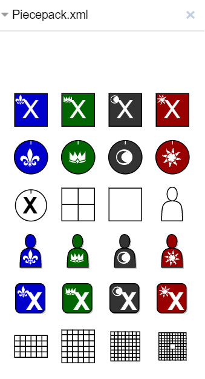

# Piecepack library for Draw.io

This is a custom shape library for [draw.io](https://www.draw.io/) to build [piecepack](https://boardgamegeek.com/boardgame/2860/piecepack) diagrams. It is licensed under [CC BY 4.0](https://creativecommons.org/licenses/by/4.0/), which means you can use it for anything as long as you credit the source.

The suit icons are from [game-icons.net](https://game-icons.net/) and are licensed under [CC BY 3.0](http://creativecommons.org/licenses/by/3.0/).
Anything built with draw.io can be used ["for any purpose"](https://desk.draw.io/support/solutions/articles/16000042494-what-are-the-usage-terms-for-diagrams-produced-by-draw-io-).

## How to install it

[Clicking this link will open draw.io and install the libary.](https://www.draw.io/?splash=0&clibs=Uhttps%3A%2F%2Fraw.githubusercontent.com%2Fselfthinker%2Fpiecepack-shape-library%2Fmaster%2FPiecepack.xml)

Alternatively, you can also download [Piecepack.xml](https://raw.githubusercontent.com/selfthinker/piecepack-shape-library/master/Piecepack.xml), go to draw.io and import the file via File > Open Library from > Device...

You will then see a new libary in the panel on the left called "Piecepack.xml".

## How to use it

Just click on a shape or drag and drop it and it will appear in the drawing area. The sizes will all fit each other, for example, a coin fits into a quarter of a tile.

### Suits

The top row seems empty. That is because they include the suits filled with white colour and are displayed on a white background. You can use the suits in other colours by changing the "Fill .symbol" colour in the Style tab of the Format panel on the right.

### Ranks

There are no shapes for each of the ranks. Instead there is just one rank labelled "X" for the tiles, coin faces and dice. You can change that to any desired rank by double-clicking it and changing the text.
The text and the suit are only overlapping when the text is an "X", this doesn't happen with a standard rank (A, 2, 3, 4, 5).
